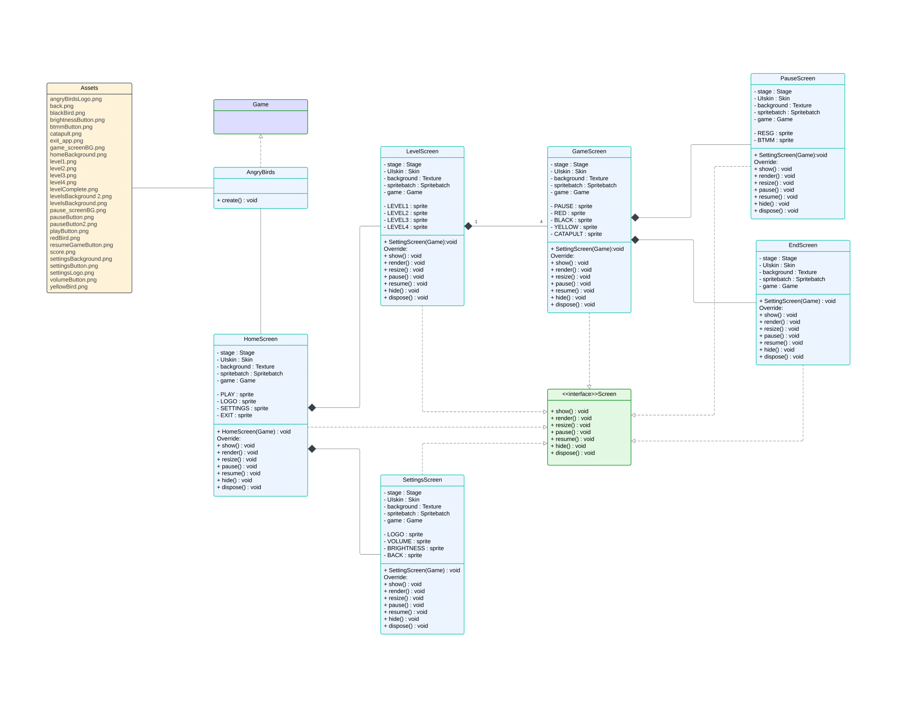

# AP Project

Angry Birds Game developed using LibGDX and Box2d by Aryamaan Singh (2023139) and Arnav Makkar (2023127). Course Project for Advanced Programming Course, CSE-201, Monsoon'24.

## Link to Video
https://drive.google.com/file/d/1si6MGOfFDlYCKgvYSja_G8nV-EiUyket/view?usp=drive_link

## Link to GitHub Repo:
https://github.com/arnav-makkar/Angry-Birds-Game

## GUI UML Class Diagram

## For Bonus
* Implemented special abilities for the Black Bird
* Implemented option to choose between 4 different sound effects
* Implemented Brightness and Volume settings
* Used IO Streams to store and keep track of previous high-scores
* Implemented 4 JUnit Tests
