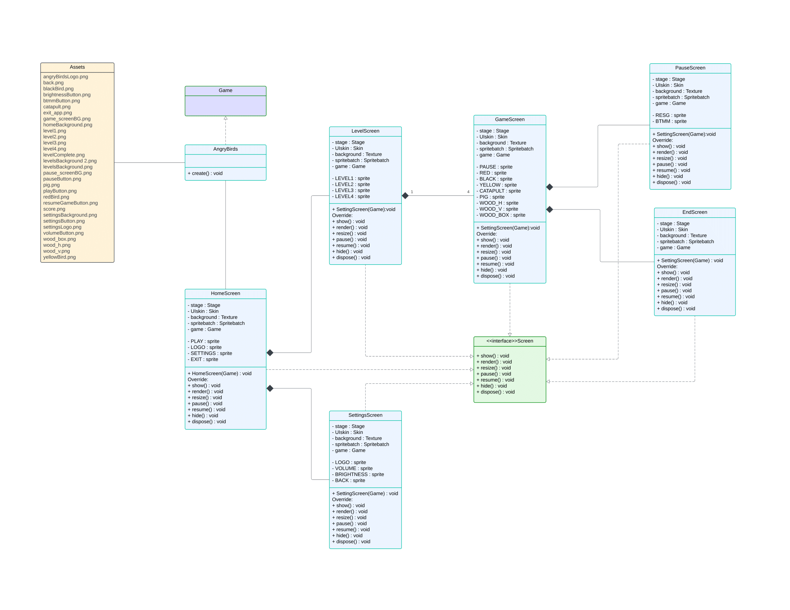

# AP Project

Angry Birds Game GUI developed using LibGDX and Java by Aryamaan Singh (2023139) and Arnav Makkar (2023127). Course Project for Advanced Programming Course, CSE-201, Monsoon'24.

All possible GUI use cases and user requirements have been implemented.

Starting the game opens the Home Screen which consists of “Play”, “Settings” and an “Exit” button.

Clicking "e" while in the Game screen ends the game and displays the user's final score.

All other functionality is self explanatory and intuitive.

## GUI UML Class Diagram

